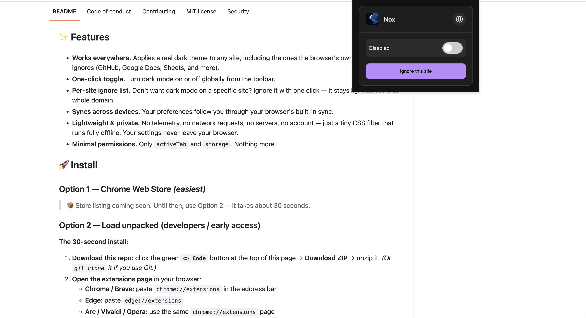
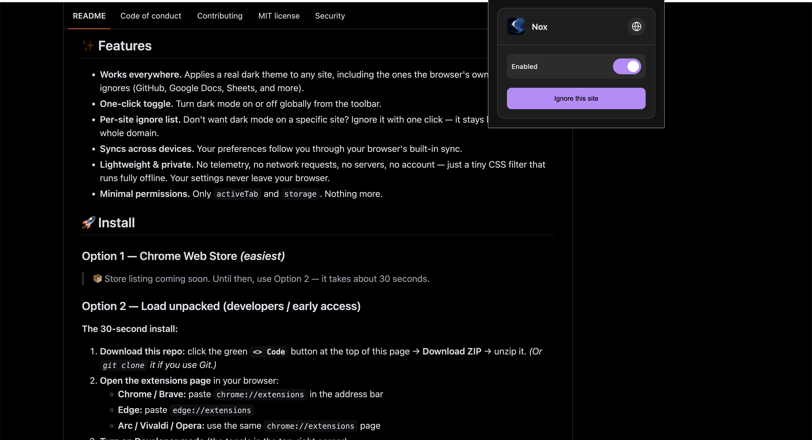

# 🌙 Nox

### **Nox** forces dark mode on **every** website — even where the browser's built-in dark mode gives up. Runs on Chrome, Edge, Brave, and any other Chromium browser.

**⭐ If this saves your eyes, please [star the repo](https://github.com/kjshuvo/nox/stargazers) — it helps others find it.**

<!--
  Search discoverability — invisible to readers, indexed by search.
  Keywords: dark mode, force dark mode, dark mode extension, chromium dark mode,
  dark reader alternative, night mode, dark theme, dark mode for github,
  dark mode google docs, dark mode google sheets, invert colors, browser extension
-->

---

Chrome, Edge, and Brave all ship a dark-mode toggle, but it silently fails on many of the sites people use every day. **GitHub, Google Docs, Google Sheets** and countless others stay blindingly light no matter what you toggle. **Nox** fixes that: one click and *any* page goes dark — properly.

> Looking for **dark mode for GitHub, Google Docs, or Google Sheets** — or a lightweight, privacy-first **Dark Reader alternative** that works fully offline? This is it.

<!-- A short GIF of the toggle is the single biggest conversion lever — swap this pair for one when you have it. -->

<em>Light</em> &nbsp;&nbsp;➡&nbsp;&nbsp; <em>Dark (one click)</em>

<table align="center">
  <tr>
    <td></td>
    <td></td>
  </tr>
</table>

## ✨ Features

- **Works everywhere.** Applies a real dark theme to any site, including the ones the browser's own dark mode ignores (GitHub, Google Docs, Sheets, and more).
- **One-click toggle.** Turn dark mode on or off globally from the toolbar.
- **Per-site ignore list.** Don't want dark mode on a specific site? Ignore it with one click — it stays light across that whole domain.
- **Syncs across devices.** Your preferences follow you through your browser's built-in sync.
- **Lightweight & private.** No telemetry, no network requests, no servers, no account — just a tiny CSS filter that runs fully offline. Your settings never leave your browser.
- **Minimal permissions.** Only `activeTab` and `storage`. Nothing more.

## 🚀 Install

### Option 1 — Chrome Web Store *(easiest)*

> 📦 Store listing coming soon. Until then, use Option 2 — it takes about 30 seconds.

<!-- Once published, swap in your store badge:
 -->

### Option 2 — Load unpacked (developers / early access)

**The 30-second install:**

1. **Download & unzip:** click the green **`<> Code`** button at the top of this page → **Download ZIP** → unzip it. *(Or `git clone` it if you use Git.)*
2. **Load unpacked:** open `chrome://extensions` (Edge: `edge://extensions`), turn on **Developer mode**, click **`Load unpacked`**, and select the unzipped folder.
3. **Pin & enjoy:** pin Nox 📌 to your toolbar, click the icon, and every page goes dark.

<b>📸 Step-by-step with screenshots</b>

<!-- Add screenshots here, e.g. docs/install/1-dev-mode.png, 2-load-unpacked.png -->
1. `chrome://extensions` with **Developer mode** switched on.
2. The **Load unpacked** button (top-left).
3. Select the folder you just unzipped (it'll be named like `nox-main`).
4. The extension appears in your list — pin it from the toolbar 🧩 menu.

<b>🛠️ Troubleshooting</b>

- **"I don't see Developer mode."** It's the toggle in the *top-right* of `chrome://extensions`. In newer Chrome it's a dropdown — set it to **On / Developer mode**.
- **Dark mode isn't applying on a tab.** Reload that tab once (`Cmd/Ctrl + R`) — content scripts only run on a fresh page load.
- **A site looks wrong (colors, images, text).** Click the extension → **Ignore this site**. That domain stays in its original theme. See [known limitations](#-how-it-works).
- **It's stuck and won't toggle.** Go to `chrome://extensions` → click the **reload** ↻ icon on the extension card.

## 🌐 Browser support

Any Chromium-based browser: **Chrome, Edge, Brave, Arc, Vivaldi, Opera**, and others. (Firefox uses a different extension API — not supported yet. PRs welcome!)

## 🔧 How it works

Nox injects a single GPU-composited CSS filter (`invert(1) hue-rotate(180deg)`) onto the page, then re-applies the same filter to media elements (``, `<video>`, `<canvas>`, `<iframe>`, `<svg>`, …) so photos and videos keep their original colours. Dark mode is toggled by adding a class to `<html>` — no per-element loops, no observers, no polling.

- State lives in `chrome.storage.sync` and updates live across tabs via `storage.onChanged`.
- The service worker runs only on install (to seed defaults) and stays dormant otherwise.

**Known limitation:** CSS `background-image` on plain elements can't be un-inverted cheaply. Most photos are ``, so the visible hit is small — but if a site relies heavily on CSS background art, it may look off. That's the trade for being instant and zero-overhead. Add such sites to the ignore list.

### 🆚 How is this different from Dark Reader?

[Dark Reader](https://github.com/darkreader/darkreader) is excellent and analyzes each element's colors ("smart" inversion) — results are often cleaner, but it's heavier on CPU, needs broad permissions, and can lag on very large pages.

**Nox** goes the other way: **one GPU filter, near-zero overhead, minimal permissions.** It's instant on any page, including ones other tools skip. The trade-off is that a few complex sites may look less polished. Pick the tool that fits the way you browse — or run both and ignore sites on whichever looks worse.

## ❓ FAQ

<b>Does it work on Google Docs, Sheets, and Slides?</b>

Yes. These are exactly the sites the browser's built-in dark mode tends to give up on, and they work here.

<b>Does it work on GitHub?</b>

Yes. (And many other developer sites that stay light by default.)

<b>How is this different from Chrome's built-in dark mode?</b>

Chrome's auto-dark only kicks in for sites that expose a dark theme; on sites that don't, nothing happens. Nox applies dark mode to *every* page regardless.

<b>Will it slow down my browser?</b>

No. It's a single GPU-composited CSS filter with no observers, polling, or background work. The service worker stays dormant after install.

<b>Is it private? Does it collect data?</b>

Completely private — no network requests and no telemetry, ever. See [🔒 Privacy](#-privacy). The entire source is in this repo.

<b>Does it sync across my devices?</b>

Yes — your on/off state and ignore list sync through your browser account (`chrome.storage.sync`).

## 🔒 Privacy

📜 **Full privacy policy — [PRIVACY.md](PRIVACY.md)** (includes the Chrome Web Store **Limited Use disclosure**).

Nox stores only your on/off preference and your ignore list, locally and synced through your browser account. **It makes no network requests, talks to no server, and collects no data — it works fully offline.** The entire source is in this repository — nothing is hidden.

### Project layout

| File | Role |
|------|------|
| `manifest.json` | Extension declaration (Manifest V3) |
| `content.js` | Injects the dark-mode filter on every page |
| `background.js` | Service worker — seeds defaults on install |
| `popup.html` / `popup.css` / `popup.js` | The toolbar popup UI and its logic |
| `icons/` | Extension icons (16/48/128 px) plus the source artwork |
| `_locales/` | Translations — one `messages.json` per language ([add yours](CONTRIBUTING.md#-translating-nox)) |

There is **no build step** — the files are loaded directly by the browser.

## 🤝 Contributing

Contributions are welcome — bug reports, site-specific fixes, docs, translations, and ideas all help. See **[CONTRIBUTING.md](CONTRIBUTING.md)** to get started, and check for [`good first issue`](https://github.com/kjshuvo/nox/labels/good%20first%20issue) tickets.

🌍 **Nox ships in 11 languages and welcomes more — plus corrections to existing ones.** It's one file and zero code — see the [Translating Nox](CONTRIBUTING.md#-translating-nox) guide.

## 🛠️ Development

No dependencies, no bundler. Edit the files, then reload the unpacked extension in `chrome://extensions` to see changes.

## 📄 License

[MIT](LICENSE) © KJ Shuvo

---

Created with ❤️ by **[KJ Shuvo](https://github.com/kjshuvo)**.

⭐ **Found this useful? [Star it](https://github.com/kjshuvo/nox/stargazers)** · 🐛 **[Report a bug](https://github.com/kjshuvo/nox/issues/new?template=bug_report.md)** · 💡 **[Request a feature](https://github.com/kjshuvo/nox/issues/new?template=feature_request.md)**

